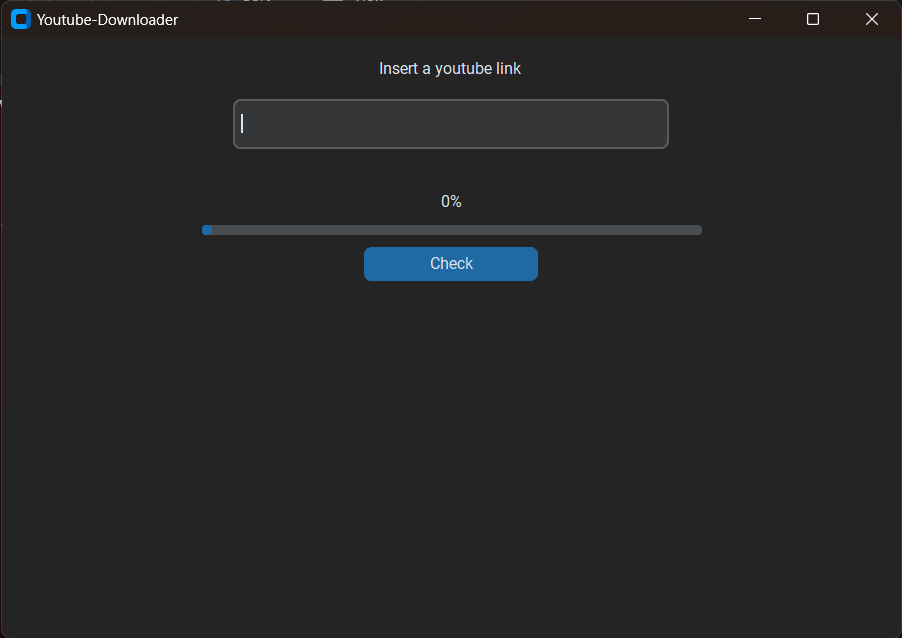
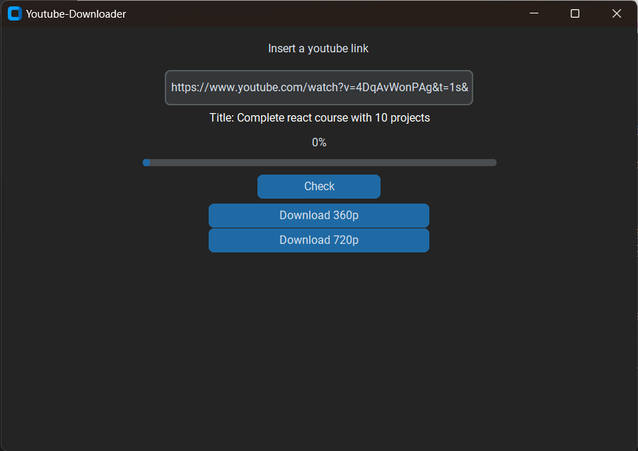
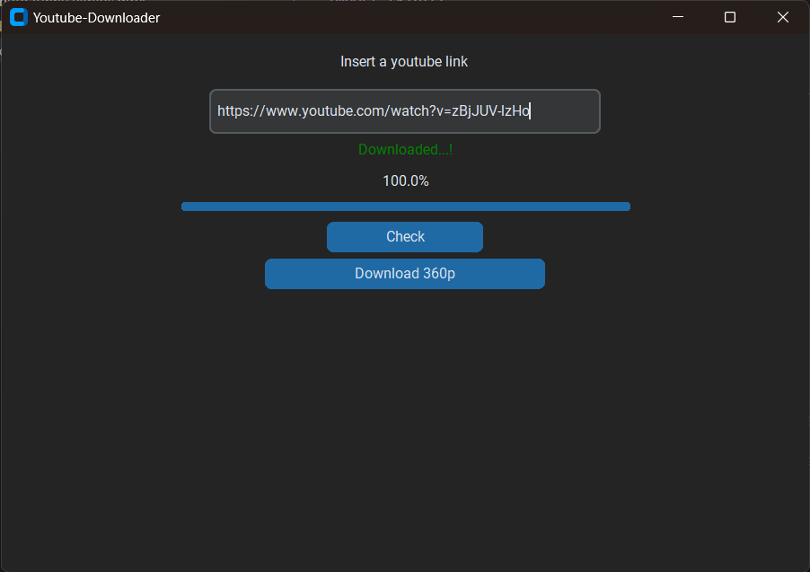

# YouTube Video Downloader App

## Overview

This Python application allows users to download YouTube videos by providing a link and selecting the desired video quality. The app is built using the Pytube library for YouTube video downloading and a custom Tkinter interface for a user-friendly experience.

## Features

- **Download YouTube Videos:** Enter a valid YouTube video link and choose from different video quality options to download.
  
- **User-Friendly Interface:** The app features a clean and intuitive Tkinter interface for easy navigation.

## Installation

1. Clone the repository to your local machine:

    ```bash
    git clone https://github.com/mukund0502/yt-video-downloader.git
    ```

2. Navigate to the project directory:

    ```bash
    cd yt-video-downloader
    ```

3. Install the required dependencies:
    * pytube
      ```bash
      pip install pytube
      ```
    * customtkinter
      ```bash
      pip install customtkinter
      ```


## Usage

1. Run the app:

    ```bash
    python yt-video-downloader-gui.py
    ```

2. Enter a valid YouTube video link in the provided input field then hit check button.

3. Use the buttons to select the desired video quality for download.

4. Click the "Download" button to start the download process.

## Dependencies

- [Pytube](https://github.com/nficano/pytube): A lightweight, dependency-free Python library for downloading YouTube videos.
- [customtkinter](https://github.com/TomSchimansky/CustomTkinter): A lightweight, dependency-free Python library for making user friendly UI.

## Contributing

Feel free to contribute to the development of this app by submitting issues or pull requests. Your feedback and contributions are welcome!

## User interface of the application




